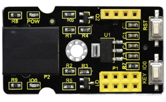
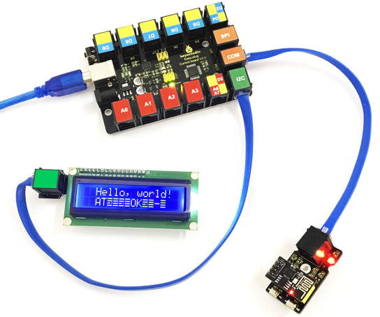
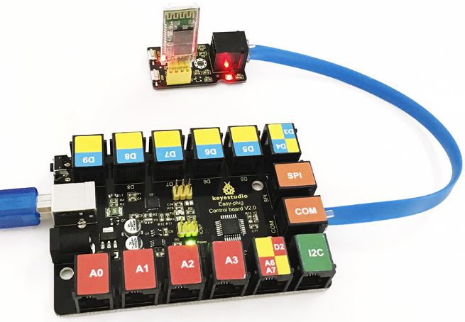
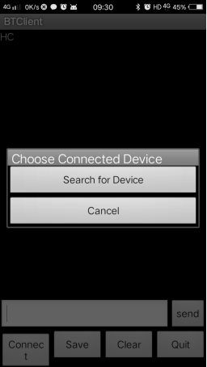
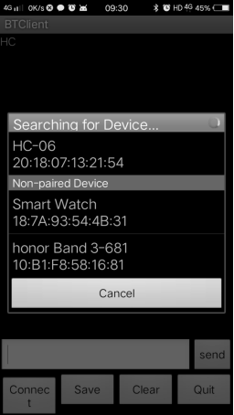
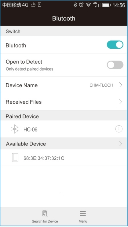
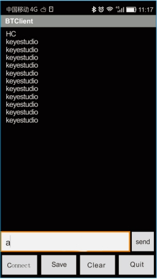
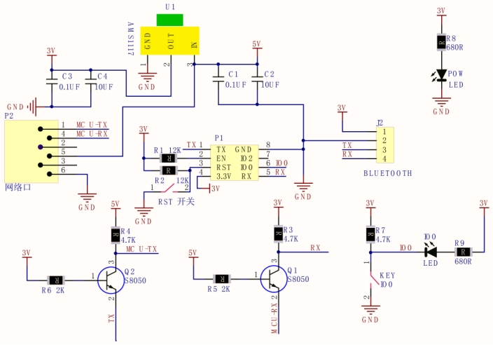

# KS0393 EASY plug WIFI and Bluetooth Shield (Black and Eco-friendly)



## 1. Description

This shield is designed for the ESP-01S WiFi module and HC-06 Bluetooth module. Onboard comes with interfaces for module.

The shield also comes with 2 buttons for connecting WiFi modules. To be specific, RST button is connecting to the WiFi module’s reset interface. KEY IO0 button is for the WiFi module’s IO0 interface.

It is very easy to connect the shield to EASY Plug control board for communication using only an RJ11 cable.

**Special Note:**

The sensor/module is equipped with the RJ11 6P6C interface, compatible with our keyestudio EASY plug Control Board with RJ11 6P6C interface.

If you have the control board of other brands, it is also equipped with the RJ11 6P6C interface but has different internal line sequence, can’t be used compatibly with our sensor/module.

## 2. Technical Parameters

- Working voltage: DC 5V
- Communication voltage: 3.3V
- Interface: EASY Plug and 2.54mm pin headers
- Environmental attributes: ROHS
- Dimensions: 44mm * 24mm * 18mm
- Weight: 6.4g

## 3. Use Method

Download  Resources :  [Resources](./Resources.7z)

**1.Connect ESP-01S WiFi module to set the AT command**

Upload the test code to EASY plug Control board V2.0, in the code, set the AT command.

Note： before uploading the code, you need to import the library files; otherwise, the code upload will fail.

Check out the test code as below:

```c
#include <Wire.h> 
#include <LiquidCrystal_I2C.h>
LiquidCrystal_I2C lcd(0x27,16,2); 

void setup()  
{   
     lcd.init();                      // initialize the lcd 
     lcd.init();
     lcd.backlight();
     Serial.begin(115200);
}

void loop() 
{
    char dat[10],flag=0;
    Serial.println("AT");
    delay(1000);
    while(Serial.available()>0)
    {
       dat[flag]=Serial.read();
       flag=flag+1;
       if(flag>10)
          break;
    }
    lcd.backlight();
    lcd.setCursor(2,0);
    lcd.print("Hello, world!");
    lcd.setCursor(2,1); 
    lcd.print(dat);
}
```

Done uploading the code, hook it up and power on, press the reset button on the control board,showing the result as below.

**Note:** if can’t make out the words clearly, you can adjust the contrast by rotating a blue potentiometer on the LCD module back).



**2.Communicate with HC-06 Bluetooth Module**

Upload the test code to EASY plug Control board V2.0, in the code, send a character **a** on the APP. When the control board receives the character **a**, the D13 indicator flashes once, and send the keyestudio.

Check out the test code as below:

```c
int val; 
int ledpin=13;

void setup() 
{ 
	Serial.begin(9600);
	pinMode(ledpin,OUTPUT); 
}

void loop()
{ 
    val=Serial.read(); 
    if(val=='a')	
    { 
        digitalWrite(ledpin,HIGH); 
        delay(250); 
        digitalWrite(ledpin,LOW); 
        delay(250);
        Serial.println("keyestudio");
    }
}
```

Done uploading the test code and plug in Bluetooth module. Power on, LED on the Bluetooth module flashes.



Then pick up your Android phone to install the Bluetooth APP (only supports the Android devices). Please pay attention to this when using. 

After the APP installed,open the mobile Bluetooth, search for Bluetooth device. If find a Bluetooth device named HC-06, pair and enter 1234, finally you should see the paired device shown as below.

Bluetooth connected, send a character **a** on your APP, then return a character keyestudio.









## 4. Schematics Diagram

